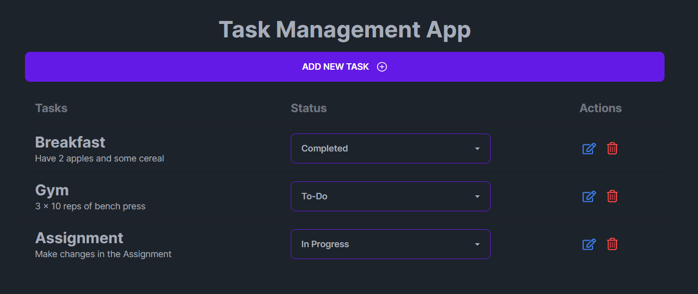

# Task Management App
A simple task management application built with Next.js

## Table of Contents

- [Introduction](#introduction)
- [Features](#features)
- [Installation and Usage](#installation-and-usage)
- [Screenshots](#screenshots)
- [Contributing](#contributing)


## Introduction
The Task Manager App is a web application that allows you to create and manage tasks efficiently. It provides a user-friendly interface for adding, updating, and deleting tasks. The application is built using Next.js, Tailwind CSS, React, and MobX, making it fast and responsive.

## Features
* Add new tasks with a title, description
* Update the status of tasks (To-Do, In Progress, Completed)
* Edit task details such as the Title and Description
* Delete tasks from the list
* Data persistence using local storage
* Responsive design for optimal viewing on various devices

## Installation and Usage

Clone the repository:

```bash
git clone https://github.com/dhananjay07b/Task-Management.git
```

Install the dependencies:

```bash
cd Task-Management
npm install
```

Run the development server:

```bash
npm run dev
# or
yarn dev
# or
pnpm dev
```

Open [http://localhost:3000](http://localhost:3000) with your browser to see the result.

Use the interface to manage your tasks. Tasks will be persisted in the browser's local storage.

You can start editing the page by modifying `./app/page.tsx`. The page auto-updates as you edit the file.

## Screenshots

### Home Page:



### Add Task:


### Edit Task:


### Delete Task


## Contributing

Contributions are welcome! If you have any ideas, suggestions, or bug reports, please open an issue or submit a pull request.

Feel free to reach out to me for further discussions on emerging technologies or any other topics of interest.

Keep the Code Alive !
